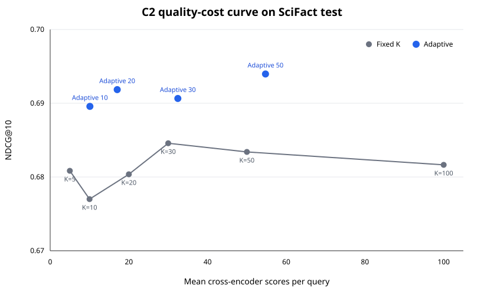

# Adaptive Reranking — V1

V1 is complete: a frozen two-tier retrieval-margin policy, SciFact quality
evaluation, and a measured end-to-end batch-throughput benchmark. The release
preserves the original algorithms, experiment settings, and recorded results.

The completed system uses exact dense search and MiniLM reranking. ANN/FAISS,
additional datasets, FastAPI serving, quantization, and interactive latency
measurements are future work tracked in the [roadmap](docs/roadmap.md).

> A zero-router-overhead policy uses retrieval confidence to reduce
> cross-encoder scoring by 67.5%, improve SciFact test NDCG@10 by 0.009, and
> deliver a measured 3.38x end-to-end online speedup versus Top-100 reranking.

<p align="center">
  
</p>

**V1 result:** At roughly one-third of the reranking budget,
the adaptive policy is both faster and more accurate than full Top-100
reranking on the held-out SciFact test set.

```text
Query -> bi-encoder Top-100 -> Top-1/Top-10 margin
                                  | easy: K=5
                                  | hard: K=50
                                  v
                         MiniLM cross-encoder -> Top-10
```

## Main result

| Policy | Mean K | NDCG@10 | Online time / 300 queries | Throughput |
| --- | ---: | ---: | ---: | ---: |
| Full Top-100 | 100.00 | 0.68165 | 368.36 s | 0.81 queries/s |
| Adaptive margin | 32.45 | **0.69065** | **109.14 s** | **2.75 queries/s** |

The paired NDCG improvement is +0.00900 with 95% bootstrap CI
`[0.00150, 0.01721]`. The frozen policy scores 9,735 instead of 30,000 pairs
and achieves a 3.38x speedup (70.37% lower online batch time) on Apple Silicon.
Model loading and the 133.90-second offline corpus-index build are excluded;
online timing includes query encoding, exact Top-100 search, routing, pair
construction, cross-encoder inference, and final Top-10 ranking. This is a
batch-throughput benchmark, not interactive per-query latency.

See [Paper](docs/paper.md) for the paper-style report and reproducibility details.

This project studies how to allocate a limited neural reranking budget. Its
final policy uses retrieval confidence to choose K=5 or K=50 from a retrieved
Top-100, scores the selected candidates in one cross-encoder batch, and
returns their strongest Top-10.

The project is independent from BEIR. It uses
[BEIR](https://github.com/beir-cellar/beir) as an installed dependency and
evaluation framework, with SciFact as the initial benchmark.

## Completed V1 evidence

- CPU bi-encoder baseline: `NDCG@10 = 0.64508` on the SciFact test split.
- Frozen validation set: 162 queries held out from SciFact train.
- MiniLM-L6 Top-100 reference: `NDCG@10 = 0.73644` on validation.
- Top-100 oracle: `NDCG@10 = 0.94206`, indicating substantial ranking headroom.
- 78.28% of validation query-document inputs exceed 256 tokens.
- Method 1 cached simulation: predicted Top-20 reaches `NDCG@10 = 0.73501`
  versus `0.73184` for retrieval Top-20, but the paired 95% bootstrap CI
  `[-0.01879, 0.02837]` includes zero.
- Although calibration selected `lambda = 1.0`, uncertainty-aware selection
  produced exactly the same validation Top-10 rankings as predicted Top-20.
  The current disagreement heuristic therefore has no supported added value.
- Method 2 feasibility test: `BAAI/bge-reranker-base` scored `0.68621`
  NDCG@10 versus MiniLM-L6's `0.73644` on the identical validation Top-100.
  The paired difference is `-0.05023` with 95% CI
  `[-0.09056, -0.01094]`, so this model pair is a routing no-go.
- Controlled MiniLM length test: 512 tokens scored `0.74060` NDCG@10 versus
  `0.73644` at 256, but the paired difference CI
  `[-0.01716, 0.02551]` includes zero and Recall@10 decreased. Longer input is
  not supported as a universal policy, although qrels-based diagnostics show
  heterogeneous effects when a relevant candidate was truncated.
- Fixed budget curve: K=20 uses 20% of the teacher scores and reaches
  `0.73184` NDCG@10, retaining 99.38% of the K=100 score. The curve is
  non-monotonic, motivating query-dependent budgets but not yet providing a
  deployable policy.
- C1 oracle analysis: 143/162 queries select K=5, but 120 are tied across all
  budgets. Lower Top-1/Top-10 retrieval margin is the strongest exploratory
  signal for needing K>5 (AUC 0.788, bootstrap CI [0.697, 0.868]).
- C2 frozen test: a two-tier margin rule at mean K=32.45 reaches `0.69065`
  NDCG@10 versus `0.68165` for full K=100; the paired difference is `+0.00900`
  with CI `[0.00150, 0.01721]`, while using 67.5% fewer teacher scores.

See [Validation report](docs/validation_report.md) for the controlled reranker
comparison and error analysis, and [Candidate selection](docs/exploratory/candidate_selection.md) for
the first candidate-selection result. [Reranker comparison](docs/exploratory/reranker_comparison.md)
records the strong-reranker feasibility test.
[Input length](docs/exploratory/input_length.md) reports the controlled 256-versus-512
token experiment.
[Fixed budget](docs/exploratory/fixed_budget.md) reports the fixed budget-quality curve
that prepares the budget-aware direction.
[Budget signal analysis](docs/exploratory/budget_signal_analysis.md) analyzes oracle
budgets and qrels-free difficulty signals.
[Adaptive budget](docs/current/adaptive_budget.md) evaluates the
frozen margin policy on the official SciFact test split.

## Repository layout

- `adaptive_reranking/`: reusable data, retrieval, reranking, routing, evaluation, and utility code.
- `scripts/`: experiment entry points and benchmark runners.
- `configs/`: unchanged experiment settings and frozen policy.
- `docs/current/`: [adaptive budget](docs/current/adaptive_budget.md), [system design](docs/current/system_design.md), and [evaluation](docs/current/evaluation.md).
- `docs/exploratory/`: candidate selection, reranker comparison, input length, fixed budget, and budget signal reports.
- `results/metrics/`, `results/figures/`, and `results/manifests/`: generated evidence, preserving experiment subdirectories.
- `results/cache/` and `results/datasets/`: ignored local caches and downloaded data.
- `tests/`: existing unit tests.

Run the commands below from the repository root after installing the project.
Tests: `python -m unittest discover -s tests -v`.

## Setup

```bash
python3.11 -m venv .venv
source .venv/bin/activate
python -m pip install --upgrade pip
python -m pip install -e .
```

## Reproduce completed V1

Prepare the baseline retrieval and frozen test teacher cache, evaluate the policy,
then run the end-to-end benchmark:

```bash
python -m scripts.run_baseline
python -m scripts.prepare_c2_test_scores
python -m scripts.evaluate_adaptive_budget
python -m scripts.benchmark_end_to_end
```

The checked-in scoring and benchmark contracts use MPS on Apple Silicon;
the bi-encoder baseline uses CPU. Preserve these settings when comparing the
recorded timings. The commands below also reproduce the exploratory evidence.

## Reproduce the baselines

```bash
python -m scripts.run_baseline
python -m scripts.run_rerank
python -m scripts.run_validation_prepare
python -m scripts.run_validation_rerank tinybert_l2
python -m scripts.run_validation_rerank minilm_l6
python -m scripts.analyze_validation
```

Large datasets, model caches, retrieval runs, and teacher-score caches are
ignored by Git. Small metrics and frozen split manifests are versioned.

## Exploratory Method 1: candidate-budget allocation

The quality reference is frozen in
[`configs/teacher.json`](configs/teacher.json): MiniLM-L6, Top-100 candidates,
256-token inputs. Method 1 compares three policies with exactly 20 teacher
scores per query:

1. retrieval Top-20;
2. predicted Top-20 using the ensemble mean `mu`;
3. uncertainty-aware Top-20 using `mu + lambda * u`, where `u` is ensemble
   disagreement and `lambda` is selected only on calibration queries.

Run the cached simulation in order:

```bash
python -m scripts.prepare_teacher_scores
python -m scripts.train_score_predictor
python -m scripts.evaluate_candidate_selection
```

`scripts/prepare_teacher_scores.py` is resumable because teacher scoring is the
expensive stage. A configuration fingerprint prevents resuming with a
different model revision, input contract, candidate order, or scoring device.
On Apple Silicon, the checked-in configuration uses MPS to generate the
offline teacher cache. The cached simulation does not report online latency.
This first version performs one candidate-selection decision
and one batched reranking call; iterative selection and stopping are reserved
for later work.

## Data discipline

- The 162 frozen validation queries are never used to fit predictors or tune
  `lambda`.
- The remaining 647 training queries are grouped for near-duplicates, then
  divided into predictor-training and calibration queries with a fixed seed.
- Teacher-score prediction is distinct from relevance prediction. Final
  quality is always evaluated with qrels.
- Test data is reserved for reporting fixed methods, not model selection.

## Exploratory Method 2: model-routing feasibility

The first routing prerequisite test intentionally implements no router. It
scores the frozen validation Top-100 with one preselected, larger reranker and
compares it with the existing MiniLM-L6 cache under the same 256-token input
contract:

```bash
python -m scripts.run_strong_reranker
```

The tested BGE-base reranker is worse than MiniLM-L6 on this validation set,
so the current pair does not justify routing work. The script is resumable and
pins the model revision, candidate pool, split, device, and preprocessing in a
cache fingerprint.

## Exploratory Method 3: input-length feasibility

The next controlled test keeps MiniLM-L6 and all candidates fixed and changes
only the maximum pair length from 256 to 512:

```bash
python -m scripts.run_length_experiment
```

The overall NDCG gain is small and uncertain, while Recall@10 decreases, so
512 tokens should not replace 256 globally. The stored diagnostics stratify
queries by truncation without implementing an adaptive policy.

## Exploratory Method 4: fixed budget-quality curve

The fixed-budget experiment uses cached MiniLM scores and introduces no new ML
method:

```bash
python -m scripts.evaluate_budget_curve
```

It evaluates K = 5, 10, 20, 30, 50, and 100 and saves both full paired metrics
and a plot-ready CSV. This fixed-budget curve is a cached quality simulation. The completed V1
benchmark below measures online batch throughput for the frozen adaptive policy.

## Exploratory C1: oracle budget analysis

Run the exploratory oracle-label and cheap-signal analysis with:

```bash
python -m scripts.analyze_oracle_budgets
```

It writes a per-query CSV, JSON summary, and SVG histogram. This analysis uses
validation qrels; its signal ranking is hypothesis generation, not final
policy evaluation.

## Completed V1: adaptive budget policy

Prepare the pinned official-test teacher cache, then evaluate the frozen
train/calibration protocol:

```bash
python -m scripts.prepare_c2_test_scores
python -m scripts.evaluate_adaptive_budget
```

The policy uses only the bi-encoder Top-1/Top-10 score margin and routes each
query to K=5 or a training-selected hard budget. The test result supports the
quality-cost contribution. The frozen policy and its latency benchmark can be
reproduced with:

```bash
python -m scripts.benchmark_end_to_end
```

The benchmark confirms that the scoring reduction survives full online-pipeline
measurement: 3.38x higher batch throughput and 70.37% lower online batch time.
No further policy tuning is performed on the closed official test split.
