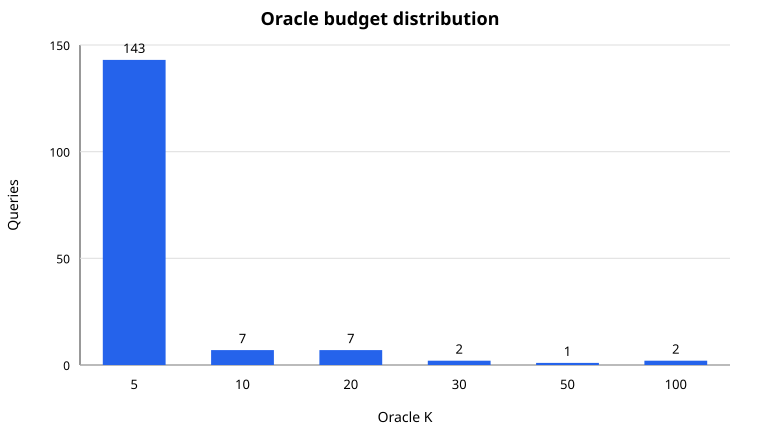

# Direction C1: oracle budget and cheap-signal analysis

## Goal

Determine whether the per-query oracle budget from Direction D has enough
structure to motivate a learnable, qrels-free adaptive budget policy.

For each frozen validation query, `oracle_k` is the smallest K in
`{5, 10, 20, 30, 50, 100}` that attains that query's maximum NDCG@10. This is
a diagnostic label produced with qrels, not an inference-time target available
to a deployed system.

## Oracle budget distribution

| Oracle K | Queries |
| ---: | ---: |
| 5 | 143 |
| 10 | 7 |
| 20 | 7 |
| 30 | 2 |
| 50 | 1 |
| 100 | 2 |

The mean oracle K is 7.62. Only 19 of 162 queries require more than K=5 under
this definition.

The distribution needs an important qualification: 120 queries receive
exactly the same NDCG@10 at every tested budget, and 142 have multiple budgets
tied for best. Selecting the smallest tied budget makes K=5 dominant. The
oracle distribution therefore shows that most queries are budget-insensitive
under sparse SciFact judgments, not that K=5 is uniquely optimal for 143
queries.

## Cheap difficulty signals

The analysis uses only information available before cross-encoder scoring:

- bi-encoder Top-1/Top-2 and Top-1/Top-10 score margins;
- score dispersion over the Top-10 and Top-100;
- normalized Top-100 score entropy;
- query-document lexical overlap in the retrieval Top-20;
- lexical diversity among the Top-20 candidates;
- query length.

Signals are evaluated against the exploratory binary label `oracle_k > 5`.
The “best direction” AUC flips a signal when lower values indicate a harder
query. Its direction and performance were selected after observing validation
labels, so the numbers are descriptive rather than an unbiased estimate of a
future policy.

| Signal | Direction for K>5 | AUC | 95% bootstrap CI | Spearman rho with K |
| --- | --- | ---: | ---: | ---: |
| Top-1 minus Top-10 margin | Lower | 0.788 | [0.697, 0.868] | -0.322 |
| Top-10 score standard deviation | Lower | 0.787 | [0.688, 0.871] | -0.320 |
| Top-1 minus Top-2 margin | Lower | 0.735 | [0.625, 0.834] | -0.257 |
| Maximum query overlap in Top-20 | Lower | 0.702 | [0.573, 0.816] | -0.230 |
| Top-100 score entropy | Higher | 0.651 | [0.520, 0.774] | 0.171 |
| Top-100 score standard deviation | Lower | 0.641 | [0.507, 0.763] | -0.159 |
| Mean query overlap in Top-20 | Lower | 0.591 | [0.456, 0.724] | -0.112 |
| Candidate lexical diversity | Lower | 0.579 | [0.449, 0.703] | -0.082 |
| Query token count | Lower | 0.552 | [0.409, 0.690] | -0.062 |

The clearest signal is the Top-1/Top-10 retrieval margin. Queries with K=5
have a mean margin of 0.1871, while queries with K>5 have a mean margin of
0.0992. A flatter retrieval head is therefore associated with needing more
reranking candidates, matching the proposed difficulty intuition.

Candidate lexical diversity and query length provide little separation in
this first analysis.

## Interpretation

C1 supports a narrow next step: test a simple margin-based allocation rule.
It does not yet establish that adaptive budget is reliably learnable because:

- only 19 validation queries have `oracle_k > 5`;
- most per-query budget outcomes are tied;
- nine signals were inspected without multiple-comparison correction;
- qrels and the frozen validation queries were used to choose the promising
  signal and its direction.

Consequently, the AUC result must not be presented as final validation
performance. The 162-query split is now exploratory for Direction C.

## Decision and next protocol

Proceed with a deliberately simple margin policy, not a learned neural router:

1. generate identical oracle-budget labels and margin signals for the existing
   522 training and 125 calibration queries from cached scores;
2. define the rule and candidate budgets using training data only;
3. select thresholds or an average-budget operating point on calibration;
4. freeze the policy;
5. use a fresh, untouched evaluation split for the final claim, since the
   existing 162 queries informed signal selection;
6. compare against fixed K at the same mean teacher-score budget.

The first policy should use the Top-1/Top-10 margin alone. Additional signals
should be included only if they add out-of-sample value beyond that baseline.
